# Routing DNS requests based on domain name

Sometimes it is necessary to be able to resolve multiple domains that live on different DNS servers from a single linux server for example. Let's say I have a TKG cluster and I need to resolve both the domains `warroyo.com` as well as `h2o.vmware.com` but they are resolved by 2 different domain servers. When setting up DNS in TKG you can provide multiple DNS servers but if you put in two different DNS servers that don't respond with the same results you will end up with intermittent failures. Luckily we also deploy NSX-ALB(AVI) for Load Balancing in TKG and we can use it to do dynamic routing to different nameservers based on domain name. This allows us to have a single DNS server that then can respond properly to both domains.


# Create a DNS virtual service

The first thing we need to do is create a VS in AVI for DNS.


## **Create a new VS with advanced config**


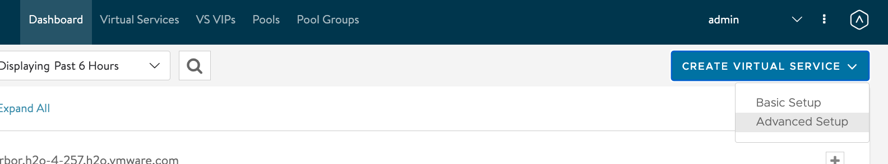


## **Input the required values for the VIP config**

   1. Name(dns)
   2. application profile(System-DNS)
   3. network for vip allocation and subnet
   4. click through all of the next options until you can save the vip. at this point we should get a an IP for the vip that will be our DNS server.
   


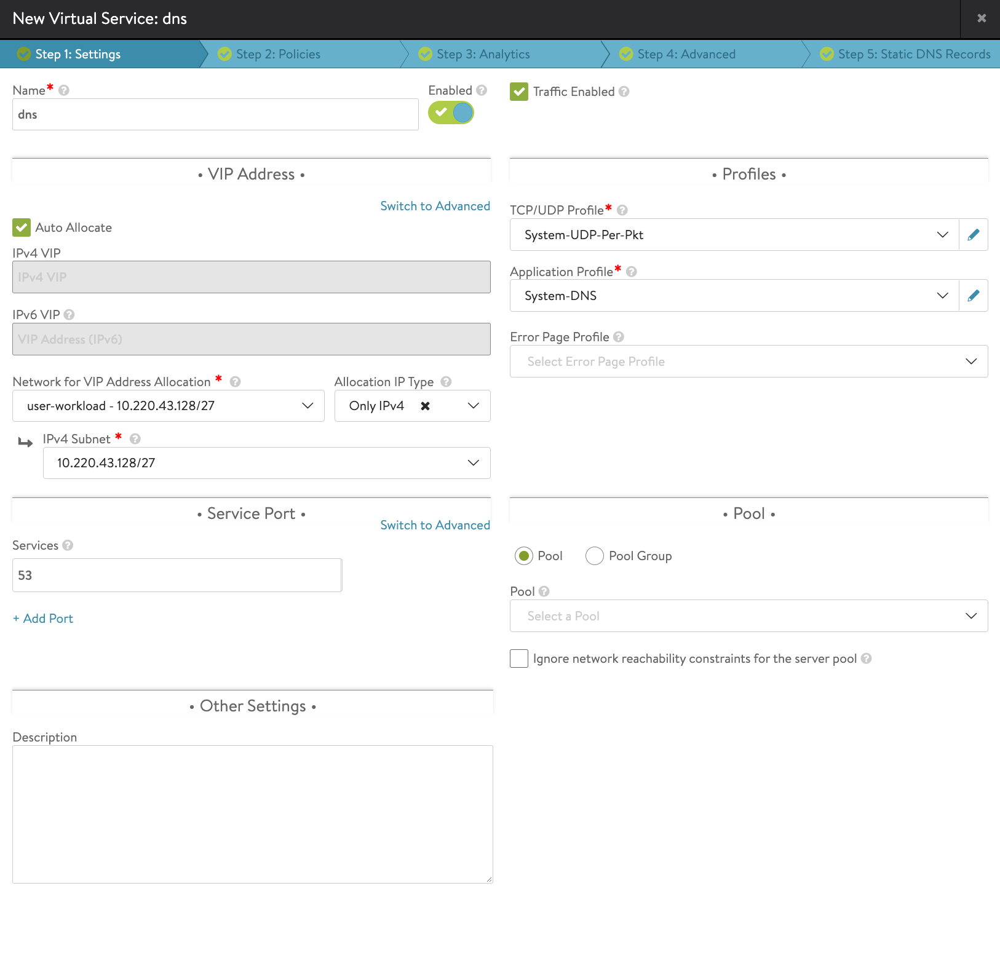


# Create some pools for each set of DNS servers


We will be creating 2 pools in this case. the first will be our default pool which will have the name servers that resolve `warroyo.com`. As well as another pool that has the DNS servers that resolve `h2o.vmware.com`. In this setup I am assuming the DNS servers in the default pool can also resolve anything else I may need except for `h2o.vmware.com` e.g. `someotherdomain.com`. If that is not that case we could setup 3 pools, a default that has upstream dns servers that resolve common domains, and 2 separate pools for our specific domains.


## **Create the default pool**
   1. give it a name(default-dns)
   2. set the port to 53

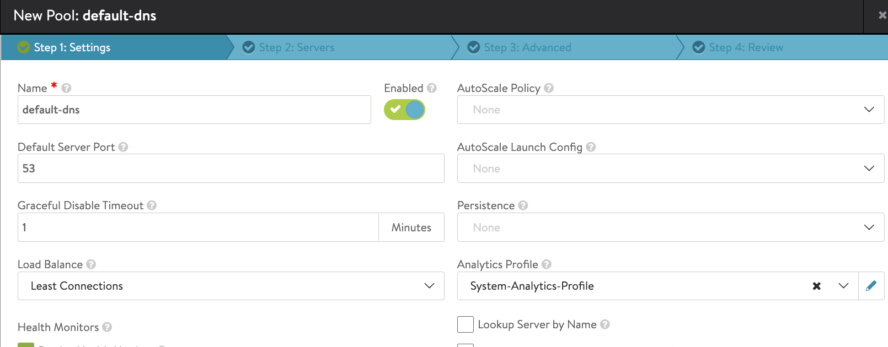


## **Add an active health monitor(screenshots below)**
   1. select "create health monitor"
   2. name the monitor something informative. In my case I will name this one `default-dns-health`
   3. select "DNS" as the type
   4. for "Request Name" put in an fqdn that you know will resolve on this set of DNS servers. In my case I am going to use `test.warroyo.com` you can use any hostname you want
   5. setup the "DNS response settings". I am going to use "Anything" and "No Error", however if you don't have FQDNs you can use for the test query you can set these to "anything" and "anything" which will just valicate it can query the server but not validate the results. see docs [here](https://avinetworks.com/docs/21.1/dns-health-monitor/)
   6. save 

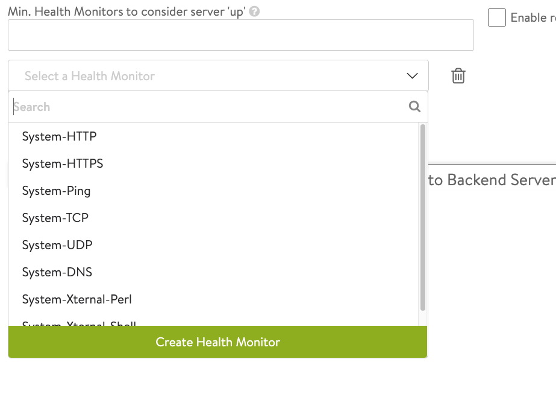

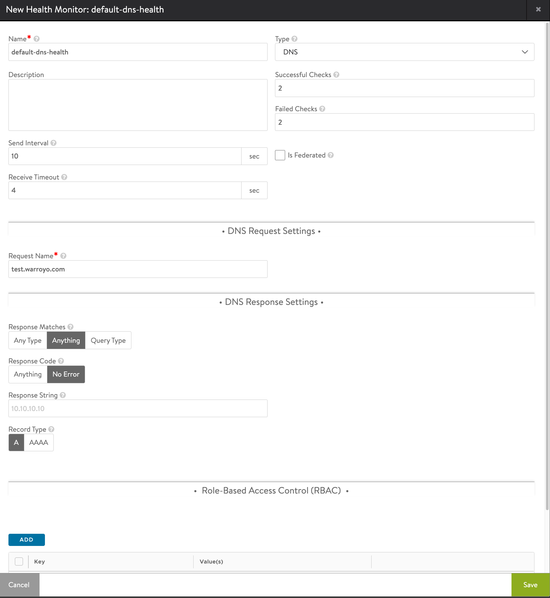


## **Add pool members**
   1. click next on the pool configuration to get to the "servers" tab
   2. input the IP addresses of the upstream DNS servers that you want to use to resolve these domains. In my case this would be my default DNS servers that resolve `warroyo.com`
   3. set the port to 53
   4. hit next and skip through the tabs until you can save

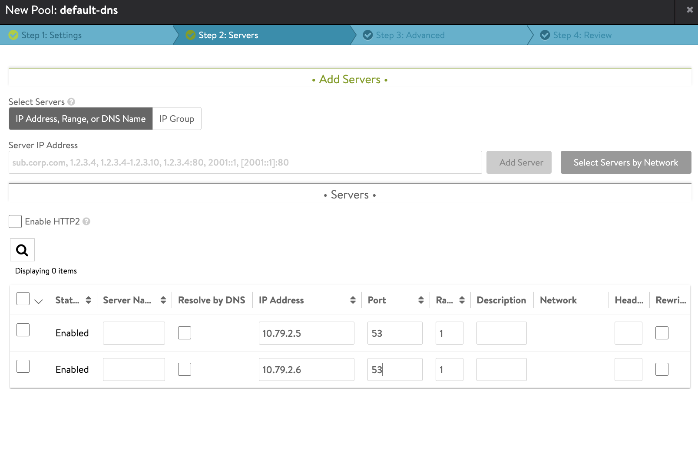


## Repeat Steps for second set of DNS Servers

1. Complete the same steps 1-3 for the second set of DNS servers. In my case this is another set of DNS servers that will resolve `h2o.vmware.com` . So I will repeat pool creation process as well as create a new active health check for this domain.


# Associate the pools with the VIP

We will now add the default pool to the vip as well as create a DNS policy that will route the secondary domain `h2o.vmware.com` to the other set of DNS Servers.

## **Add the default dns pool to the vip** 
   1. edit the dns vip
   2. select the pool from the dropdown.


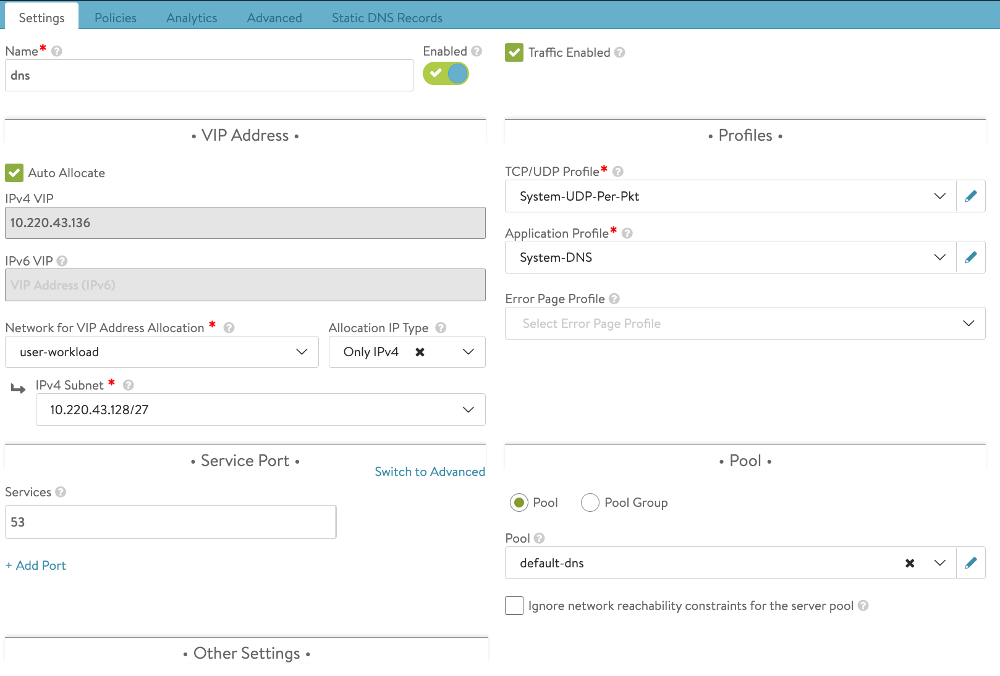


## **Create a new DNS policy**
   1. click on the "policies" tab at the top of the vip edit screen.
   2. go to the "DNS Policy" subtab
   3. click the big green button to add a policy
   4. name the rule something that identifies it e.g. route-to-h2o
   5. choose "Query Name" for matches
   6. select "ends with" for criteria
   7. put in the domain name you want to match. In my case this is `h2o.vmware.com`
   8. select "pool switching" for the action
   9. choose the pool we created above that has the DNS servers for this domain. In my case this is `h2o-dns-pool`
   10. submit, then save


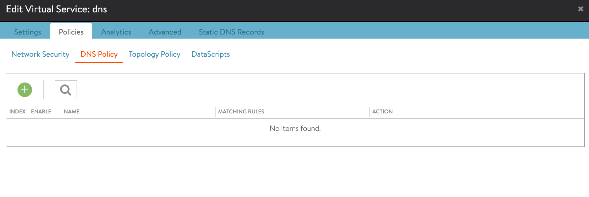
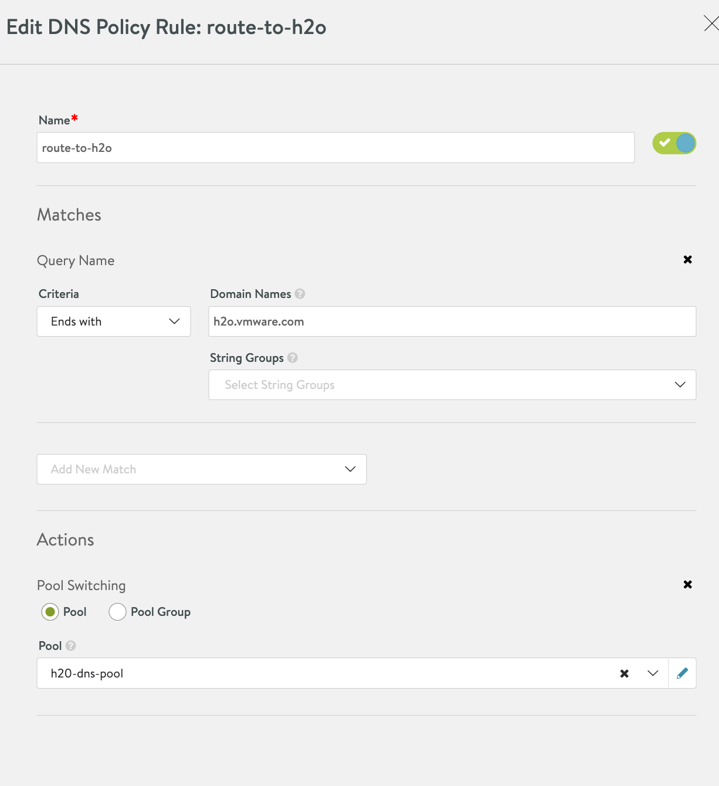


# Validation

At this point you should see that the pools are showing healthy for the dns servers and the vip is green. In order to test this we can do two nslookup queries and look at the logs and make sure it's routing properly.


## **Check the default pool**

 In my case this is anything other than `h2o.vmware.com`. replace `<dns vip ip>` with your DNS vip from AVI. this should result in a successfuly query. 
```
nslookup test.warroyo.com <dns vip ip>
```

## **Check the doman specific pool**

 In my case this is for `h2o.vmware.com`. Replace `<dns vip ip>` with your DNS vip from AVI. this should result in a successfuly query. 

```
nslookup test.h2o.vmware.com <dns vip ip>
```

## Check the logs

We can now look in the VS logs to ensure it routed correctly.Click on the DNS vip and then the "logs" tab. you should see a list of request logs. click on one of the logs and it will open and show you the flow of the request. In the screenshot below you can see the request for `test.h2o.vmware.com` routing correctyl to the domain specific pool.


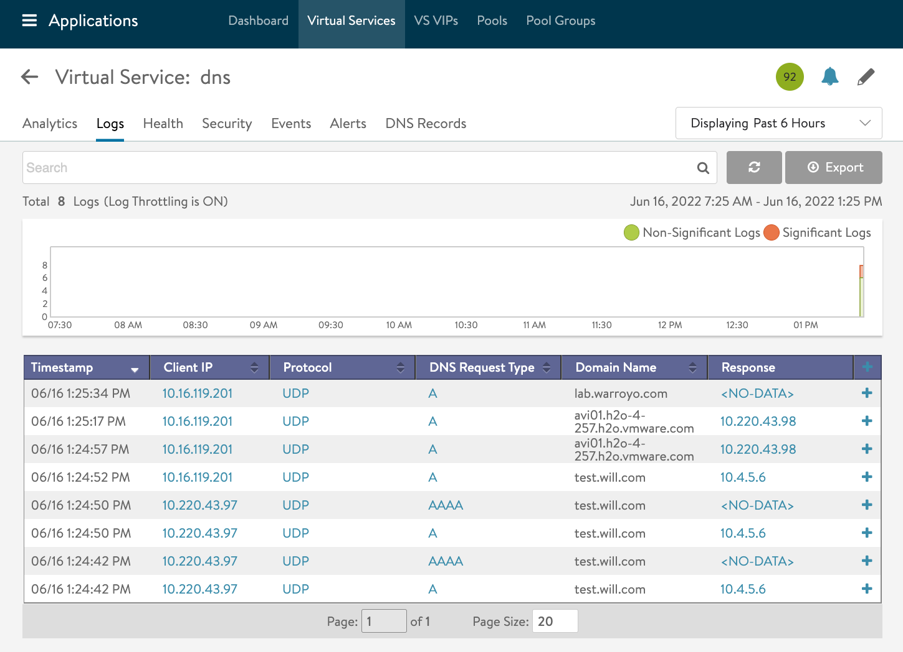
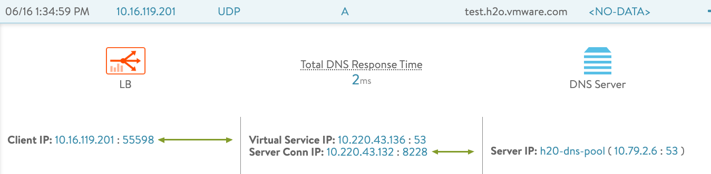