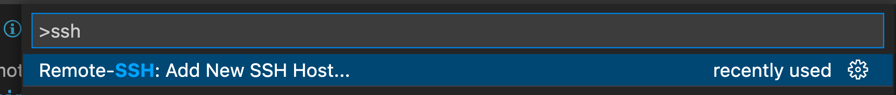
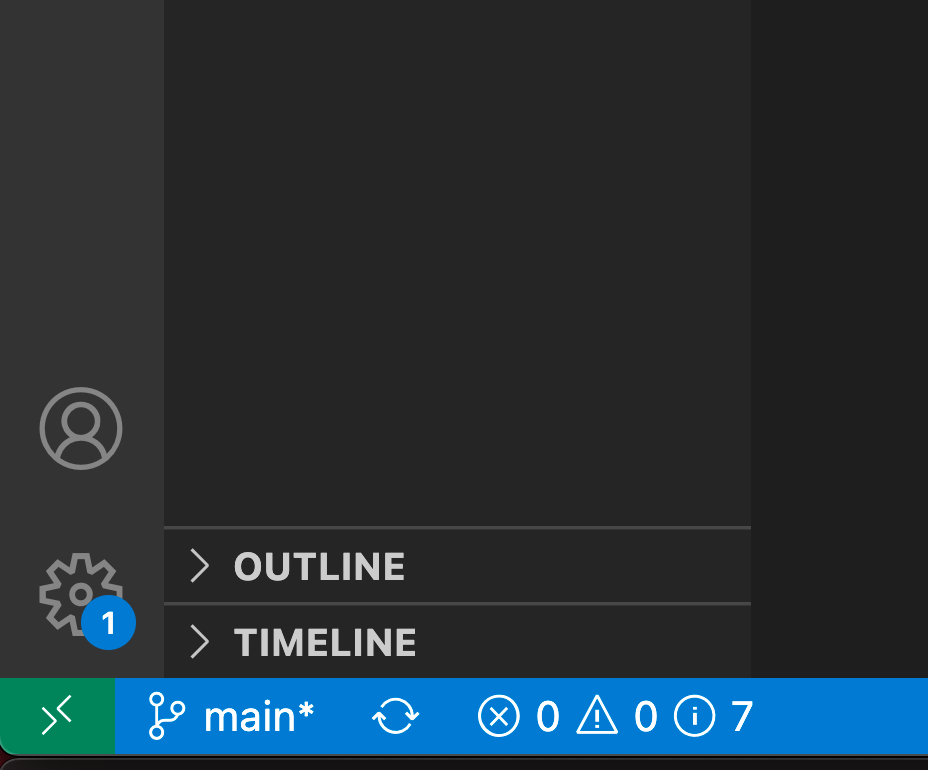
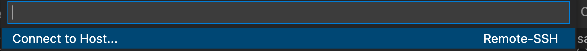
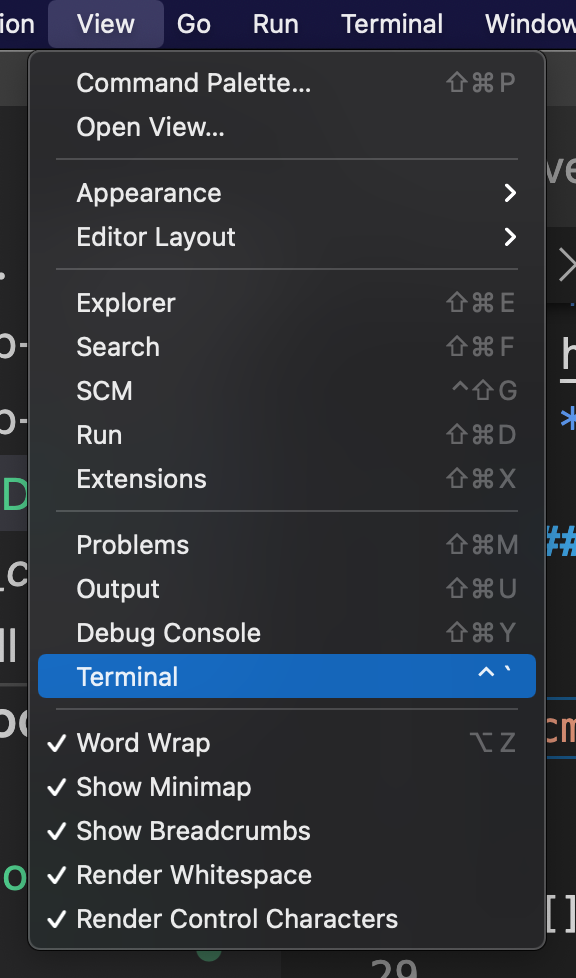
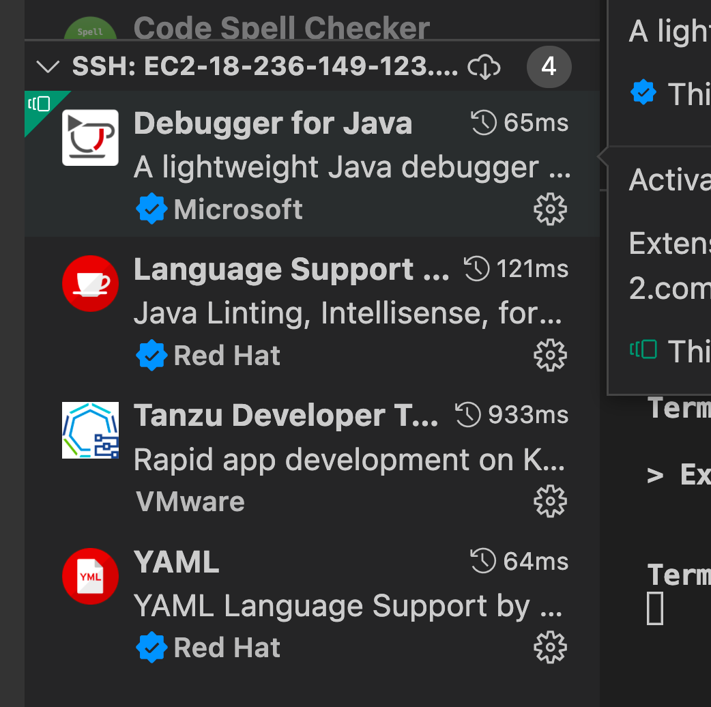
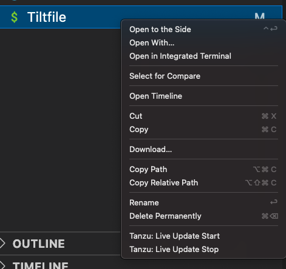
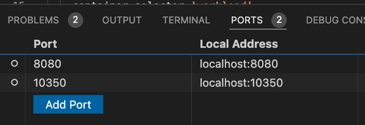

# Using Live Update with VSCode Remote SSH

VSCode has a nice [extension](https://marketplace.visualstudio.com/items?itemName=ms-vscode-remote.remote-ssh) that allows you to connect to a host over ssh and use the IDE while connecting to remote directories and has an integrated terminal and port forwarding. This doc walks through using this extension along with the Tanzu VSCode extension to get live reloads of your app running on TAP while iterating on code and using a remote host that has all of the tools installed. Here are some scenarios this may be useful.

* Environments where a Bastion host is required
* Workshops
* Decoupling your workstation from dev tooling
* Consistent and ephemeral jumpboxes for Devs


# Contents
<!-- vscode-markdown-toc -->
* 1. [Prerequisites](#Prerequisites)
* 2. [Setup your remote host in VSCode](#SetupyourremotehostinVSCode)
* 3. [Setup a sample app](#Setupasampleapp)
	* 3.1. [Connect to your remote host](#Connecttoyourremotehost)
* 4. [Enable the Tanzu extension on the remote host](#EnabletheTanzuextensionontheremotehost)
	* 4.1. [Configure the Tanzu plugin](#ConfiguretheTanzuplugin)
	* 4.2. [Clone down the sample app and open it in VSCode](#ClonedownthesampleappandopenitinVSCode)
	* 4.3. [Edit the tilt file that comes with the sample](#Editthetiltfilethatcomeswiththesample)
	* 4.4. [Deploy using live update](#Deployusingliveupdate)
	* 4.5. [Visit your app and tilt UI](#VisityourappandtiltUI)
* 5. [Deploying a DotNet app with live updates](#DeployingaDotNetappwithliveupdates)
	* 5.1. [Clone down the sample DotNet app and open it in VSCode](#ClonedownthesampleDotNetappandopenitinVSCode)
	* 5.2. [Create a tilt file for sample DotNet app](#CreateatiltfileforsampleDotNetapp)
	* 5.3. [Create a workload yaml file for sample DotNet app](#CreateaworkloadyamlfileforsampleDotNetapp)

<!-- vscode-markdown-toc-config
	numbering=true
	autoSave=true
	/vscode-markdown-toc-config -->
<!-- /vscode-markdown-toc -->

#

##  1. <a name='Prerequisites'></a>Prerequisites

* VSCode on your local workstation
* [Tanzu Vscode plugin](https://docs.vmware.com/en/Tanzu-Application-Platform/1.0/tap/GUID-vscode-extension-install.html) installed and enabled on the remote ssh setup. See the section below on enabling the plugin on the remote host
* TAP running on a k8s cluster
* A developer namespace setup in TAP
* a linux host
  * [tanzu cli and plugins](https://docs.vmware.com/en/Tanzu-Application-Platform/1.0/tap/GUID-install-tanzu-cli.html#cli-and-plugin) installed on linux host
  * [Tilt](https://docs.tilt.dev/install.html) installed on linux host

##  2. <a name='SetupyourremotehostinVSCode'></a>Setup your remote host in VSCode


`cmd + shift + p`(mac) or `ctrl+ shift + p`(windows) and search for ssh. 





paste in the ssh command to access your instance, here is an example. be sure to have your private key setup properly.

```bash
ssh -i ~/.ssh/mykey.pem ubuntu@ec2-18-226-149-123.us-west-2.compute.amazonaws.com
```

It should prompt you to store the config and then you can connect to the host.


##  3. <a name='Setupasampleapp'></a>Setup a sample app

docs [here](https://docs.vmware.com/en/Tanzu-Application-Platform/1.0/tap/GUID-vscode-extension-install.html#quick-start-3) for reference.

###  3.1. <a name='Connecttoyourremotehost'></a>Connect to your remote host

In the bottom left hand corner of VSCode click the little green button



Then choose connect to host and pick your host with the tooling installed on it.



A new window will open that is connected to the remote host. Now we need to open a terminal.Choose View->Terminal



##  4. <a name='EnabletheTanzuextensionontheremotehost'></a>Enable the Tanzu extension on the remote host

With VSCode plugins they are installed locally initially and need to be synced to the remote host.

On the remote VSCode session click on the extension tab on the left hand side of the VSCode window. You will see extensions installed locally and also on the remote host. Most likely there will be no extensions on the remote tab which has a header of the machine name you are connected to. Click the button that looks like a cloud with an arrow to sync the extensions to the remote host. see the image below.



After clicking the cloud/arrow button it will ask which extensions you would like to sync. choose the tanzu extension.

###  4.1. <a name='ConfiguretheTanzuplugin'></a>Configure the Tanzu plugin

The Tanzu plugin has some base configuration that needs to be setup. This is the global setting for where the app lives and the image you want to use. This doesn't work great for multiple apps so we will put some defaults there and override them later.

go to `Preferences > Settings > Extensions > Tanzu`

update the `Source Image` field to be something like `your-registry.io/project/dummyapp` this does not need to exist since we will override it.

###  4.2. <a name='ClonedownthesampleappandopenitinVSCode'></a>Clone down the sample app and open it in VSCode


From the above terminal run the following

```
git clone https://github.com/sample-accelerators/tanzu-java-web-app
```

Once this is clones down we now need to open it in VSCode. Again from the terminal run below command and a new window will open to your remote session but this time it will be in the directory we need to be in for live update to work. 

```bash
code tanzu-java-web-app
```


###  4.3. <a name='Editthetiltfilethatcomeswiththesample'></a>Edit the tilt file that comes with the sample

The existing tilt file needs a few modifications to work.

1. replace the top 2 lines that define the source image and local path with static values since we don't want to use the global settings. make sure the settings match your registry and the path to your source code.

**before:**

```bash
SOURCE_IMAGE = os.getenv("SOURCE_IMAGE", default='yourregistry.com/project/tanzu-java-web-app-source')
LOCAL_PATH = os.getenv("LOCAL_PATH", default='/home/ubuntu/tanzu-java-web-app')
```

**after:**

```bash
SOURCE_IMAGE = 'yourregistry.com/project/tanzu-java-web-app-source'
LOCAL_PATH = '/home/ubuntu/tanzu-java-web-app'
```


2. add the k8s context we are using to the bottom of the file. get the context using kubectl and then add the line below to the end of the tilt file replacing the context name.

```bash
allow_k8s_contexts('mycontext@mycontext')
```

###  4.4. <a name='Deployusingliveupdate'></a>Deploy using live update

First we need to login to the registry from the remote host. From the terminal run `docker login yourregistry.com`


Right click on your tilt file and click "Tanzu: Live Update Start"





this should trigger a terminal to open and the image build process as well as deploy to happen. You can now edit files and see the live reload take affect.


###  4.5. <a name='VisityourappandtiltUI'></a>Visit your app and tilt UI

VSCode will automatically forward  ports that it finds running on the remote host after you start a process. This is helpful becuase you can now visit your app and the Tilt UI from your local workstation while the app is running a remote k8s cluster and being deployed from a bastion host. From the VSCode UI click on the port tab next to terminal and you will see the tilt port forwarded. if you do not see a port for you app you can just click add port and type in the port number, for the sample app this is port 8080. visit this on your local workstation browser to see your app.




##  5. <a name='DeployingaDotNetappwithliveupdates'></a>Deploying a DotNet app with live updates

If you have completed all of the steps above you can jump right to this section. If you want to start with DotNet be sure to complete through [Configure the Tanzu plugin](#configure-the-tanzu-plugin).


###  5.1. <a name='ClonedownthesampleDotNetappandopenitinVSCode'></a>Clone down the sample DotNet app and open it in VSCode


From the above terminal run the following

```
git clone https://github.com/pacphi/AltPackageRepository
```

Once this is clones down we now need to open it in VSCode. Again from the terminal run below command and a new window will open to your remote session but this time it will be in the directory we need to be in for live update to work. 

```bash
code AltPackageRepository
```

###  5.2. <a name='CreateatiltfileforsampleDotNetapp'></a>Create a tilt file for sample DotNet app

Copy the text below into a file called `Tiltfile` in the root of the repo. Replace the top two lines `SOURCE_IMAGE` and `LOCAL_PATH` with the correct values for your registry and the path to the app. Also you will need to update the k8s context `allow_k8s_contexts` with your context that you can get from kubectl.


```bash
SOURCE_IMAGE = 'yourregistry.com/project/altpackagerepository'
LOCAL_PATH = '/home/ubuntu/altpackagerepository'
NAMESPACE = 'default'
NAME = "altpackagerepository"


k8s_custom_deploy(
  NAME,
  apply_cmd="tanzu apps workload apply -f ./config/workload.yaml --live-update" +
            " --local-path " + LOCAL_PATH +
            " --source-image " + SOURCE_IMAGE +
            " --namespace " + NAMESPACE +
            " --yes >/dev/null" +
            " && kubectl get workload " + NAME + " -n " + NAMESPACE + " -o yaml",
  delete_cmd="tanzu apps workload delete " + NAME + " -n " + NAMESPACE + " --yes",
  deps=['./src'],
  container_selector='workload',
)

k8s_resource(NAME, port_forwards=["8080:8080"],
            extra_pod_selectors=[{'serving.knative.dev/service': 'altpackagerepository'}])

allow_k8s_contexts('context@context')
```

###  5.3. <a name='CreateaworkloadyamlfileforsampleDotNetapp'></a>Create a workload yaml file for sample DotNet app

The sample app currently has a `workload.yaml` file but it needs some modifications. Replace the `config/workload.yaml` with the below contents.

```yaml
apiVersion: carto.run/v1alpha1
kind: Workload
metadata:
  name: altpackagerepository
  labels:
    apps.tanzu.vmware.com/workload-type: web
    app.kubernetes.io/part-of: altpackagerepository
spec:
  params:
  - name: annotations
    value:
      autoscaling.knative.dev/minScale: "1"
  source:
    git:
      url: https://github.com/pacphi/AltPackageRepository
      ref:
        branch: main

```


You can now jump back to [Deploy using live update](#deploy-using-live-update)