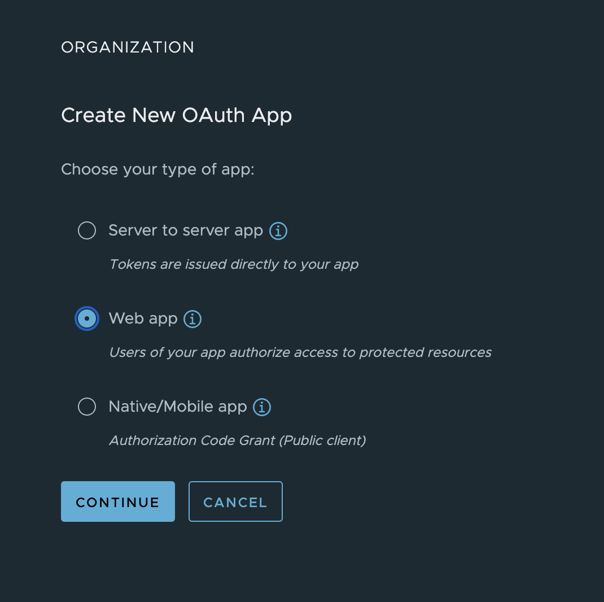
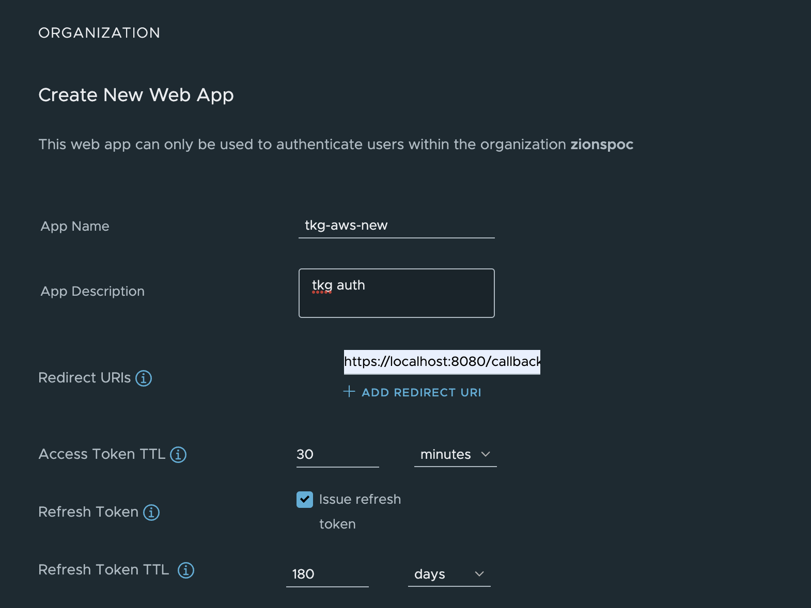
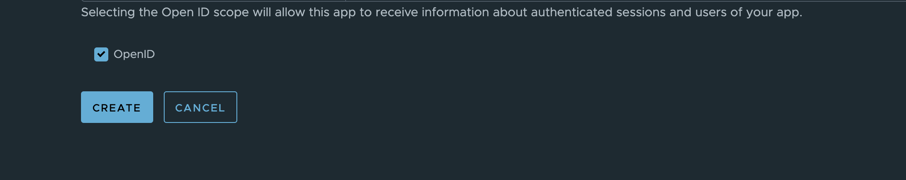
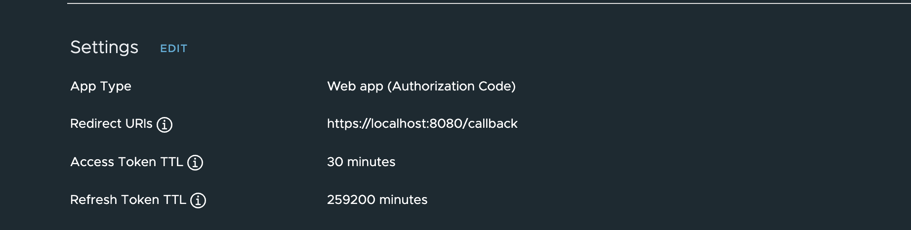

# CSP OIDC Auth for TKG Clusters

This will outline the process for setting up auth on the TKG management cluster using OIDC and VMWare CSP as the provider.Auth in TKG is handled by Pinniped behind the scenes.

## Prerequisites

* CSP org and permission to create an oAuth app.
* TKG management cluster(existing or new) 


## Set your default CSP org

This is only required temporarily, the version of pinniped packaged with TKG(1.5.3 as of this post) does not yet support the required flag to set the org id from pinniped. For this reason we need to have our default org set in CSP so when we redirect for SSO it will go to the right org. The field needed can be found [here](https://github.com/vmware-tanzu/pinniped/blob/main/generated/1.23/README.adoc#oidcauthorizationconfig) `additionalAuthorizeParameters` and a field `orgLink` could be added. 

1. login to CSP and click on your name in the upper right corner to open the menu. You will see the "Default Organization" drop down, select the org that you will be creating the OAuth app in as your default org.


## Create a CSP oAuth app for TKG

1. login to your CSP org and navigate to the left sidebar and click on "Organization"->"OAuth Apps"->"Create New OAuth App"


2. Select "Web App" as the app type



3. Give the app a name, description, select to enable "refresh tokens", and put in a temporary callback url. We will be updating the callback url once we get the correct endpoint from pinniped on TKG. Lastly select the "OpenID" checkbox. We do not need to provide any roles from CSP since we are just using it for authentication and will use k8s rbac for authorization.
   




4. Create the app.
5. Copy the app ID and app secret or download the json provided.


## Update the app to use the correct issuer url

This is needed becuase the default settings on csp apps are not setup with CSP issuer url in the correct field. a flag has been added that can be enabled through the API to change this. this is required for CSP to be used as an OIDc provider for pinniped.

1. follow the docs [here](https://docs.vmware.com/en/VMware-Cloud-services/services/Using-VMware-Cloud-Services/GUID-E2A3B1C1-E9AD-4B00-A6B6-88D31FCDDF7C.html) to get an auhtorization token to use in the api request. This is different than the token from the UI, you use the token from the UI to generate this API token.

2. Issue the api request to csp to update the field. replace the orgid and oauthappid 

```bash
curl https://console.cloud.vmware.com/ccs/gateway/am/api/orgs/{orgId}/oauth-apps/{oauthAppId}  -d '{ "useCspIssuerUrl": "true" }' -H "Content-Type: application/json"
```


## Setup the TKG management cluster with auth

The docs for doing this can be found [here](https://docs.vmware.com/en/VMware-Tanzu-Kubernetes-Grid/1.5/vmware-tanzu-kubernetes-grid-15/GUID-iam-configure-id-mgmt.html), this is a shortened version. Please refer to the docs for all options as well as for doing this on an existing management cluster.


1. Add the required configuration to the Management cluster config yaml

```yaml
IDENTITY_MANAGEMENT_TYPE: oidc
OIDC_IDENTITY_PROVIDER_CLIENT_ID: "app-id-here"
OIDC_IDENTITY_PROVIDER_CLIENT_SECRET: "app-secret-here"
OIDC_IDENTITY_PROVIDER_GROUPS_CLAIM: "group_names"
OIDC_IDENTITY_PROVIDER_ISSUER_URL: "https://console.cloud.vmware.com"
OIDC_IDENTITY_PROVIDER_NAME: "csp"
OIDC_IDENTITY_PROVIDER_SCOPES: "openid,group_names,groups,email"
OIDC_IDENTITY_PROVIDER_USERNAME_CLAIM: "email"
```

2. create your management cluster.


## Validate Pinniped is running and get the callback url

1. login as admin to the mgmt cluster

```bash
tanzu mc kubeconfig get <cluster-name> --admin
```

2. switch into the mgmt cluster context

```bash
kubectl config use-context clustername-admin@clustername
```

3. make sure all of the pinniped components are running

```bash
kubectl get all -n pinniped-supervisor
```

4. get the ip or url for the pinniped supervisor service this will be the "external ip"

```bash
kubectl get service pinniped-supervisor -n pinniped-supervisor
```

## Update the callback url in CSP

1. Login to your csp org
2. Click on "Organization"->"OAuth Apps"->"your-app"
3. Edit the settings



4. update the callback with the above pinniped-supervisor ip/url 

```bash
https://EXTERNAL-IP/callback
```


## Test your login

1. Get the kubeconfig from the mgmt cluster. We will put this in a temp kubeconfig this way we can test easily.

```bash
tanzu mc kubeconfig get --export-file /tmp/mgmt-test-kubeconfig
```

2. run `kubectl` to initiate the auth flow. Since we haven't given permissions out you should end up with a successful authentication but an error from k8s rbac about getting pods until we assign some rbac.

```bash
kubectl get pods -A --kubeconfig /tmp/mgmt-test-kubeconfig
```


